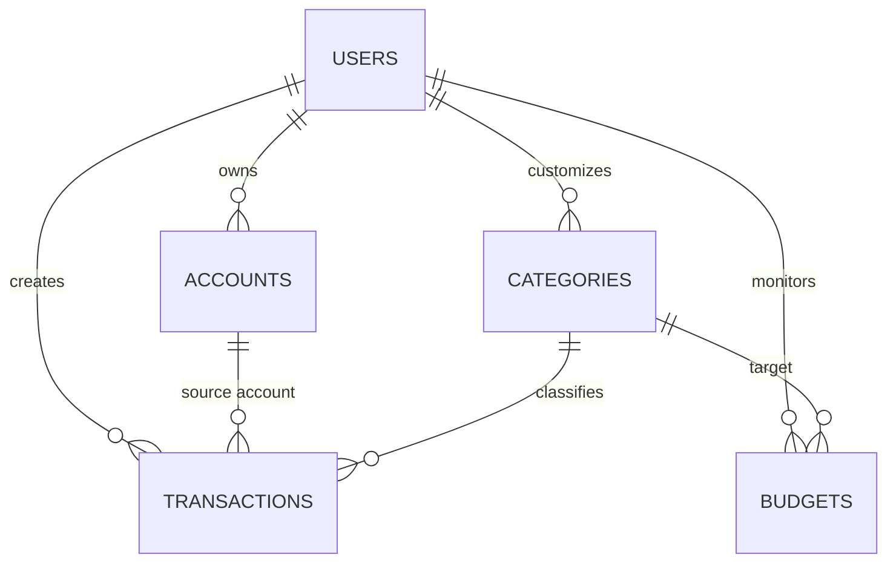

# 🗄️ Database Schema & Data Models

This document serves as the absolute ground truth for all database tables, columns, relations, and TypeScript models in the Money Tracker application.

---

## 📊 Entity Relationship Diagram



---

## 🗂️ Database Tables (Drizzle ORM Dialect)

### 1. `users`
Stores user profile information.
```typescript
import { pgTable, text, timestamp, uuid } from "drizzle-orm/pg-core";

export const users = pgTable("users", {
  id: uuid("id").defaultRandom().primaryKey(),
  email: text("email").notNull().unique(),
  name: text("name"),
  createdAt: timestamp("created_at").defaultNow().notNull(),
  updatedAt: timestamp("updated_at").defaultNow().notNull(),
});
```

### 2. `accounts`
Represents payment methods (e.g., Cash, Chase Checking, Credit Card, Savings).
```typescript
import { pgTable, text, timestamp, uuid, numeric } from "drizzle-orm/pg-core";
import { users } from "./users";

export const accounts = pgTable("accounts", {
  id: uuid("id").defaultRandom().primaryKey(),
  userId: uuid("user_id").references(() => users.id, { onDelete: "cascade" }).notNull(),
  name: text("name").notNull(), // e.g., "Cash", "Bank Account"
  type: text("type").notNull(), // "cash" | "bank" | "credit" | "investment"
  balance: numeric("balance", { precision: 12, scale: 2 }).default("0.00").notNull(),
  currency: text("currency").default("USD").notNull(),
  createdAt: timestamp("created_at").defaultNow().notNull(),
  updatedAt: timestamp("updated_at").defaultNow().notNull(),
});
```

### 3. `categories`
Classifications for expenses and income. Includes color and icon tokens for visual rendering.
```typescript
import { pgTable, text, timestamp, uuid } from "drizzle-orm/pg-core";
import { users } from "./users";

export const categories = pgTable("categories", {
  id: uuid("id").defaultRandom().primaryKey(),
  userId: uuid("user_id").references(() => users.id, { onDelete: "cascade" }).notNull(),
  name: text("name").notNull(), // e.g., "Groceries", "Salary"
  type: text("type").notNull(), // "income" | "expense"
  icon: text("icon").default("tag").notNull(), // Lucide icon identifier
  color: text("color").default("#10b981").notNull(), // Emerald green hex/token default
  createdAt: timestamp("created_at").defaultNow().notNull(),
});
```

### 4. `transactions`
The core ledger. Tracks incomes, expenses, and transfers between internal accounts.
```typescript
import { pgTable, text, timestamp, uuid, numeric, boolean } from "drizzle-orm/pg-core";
import { users } from "./users";
import { accounts } from "./accounts";
import { categories } from "./categories";

export const transactions = pgTable("transactions", {
  id: uuid("id").defaultRandom().primaryKey(),
  userId: uuid("user_id").references(() => users.id, { onDelete: "cascade" }).notNull(),
  accountId: uuid("account_id").references(() => accounts.id, { onDelete: "cascade" }).notNull(),
  categoryId: uuid("category_id").references(() => categories.id, { onDelete: "set null" }),
  
  type: text("type").notNull(), // "income" | "expense" | "transfer"
  amount: numeric("amount", { precision: 12, scale: 2 }).notNull(),
  date: timestamp("date").notNull(),
  description: text("description"),
  
  // Transfers point to another internal account
  toAccountId: uuid("to_account_id").references(() => accounts.id, { onDelete: "set null" }),
  
  // Reconciled flag (for statement matching)
  isCleared: boolean("is_cleared").default(true).notNull(),
  
  createdAt: timestamp("created_at").defaultNow().notNull(),
  updatedAt: timestamp("updated_at").defaultNow().notNull(),
});
```

### 5. `budgets`
Tracks monthly spending thresholds per category.
```typescript
import { pgTable, timestamp, uuid, numeric } from "drizzle-orm/pg-core";
import { users } from "./users";
import { categories } from "./categories";

export const budgets = pgTable("budgets", {
  id: uuid("id").defaultRandom().primaryKey(),
  userId: uuid("user_id").references(() => users.id, { onDelete: "cascade" }).notNull(),
  categoryId: uuid("category_id").references(() => categories.id, { onDelete: "cascade" }).notNull(),
  limitAmount: numeric("limit_amount", { precision: 12, scale: 2 }).notNull(),
  startDate: timestamp("start_date").notNull(), // Beginning of the budget cycle month
  endDate: timestamp("end_date").notNull(),
  createdAt: timestamp("created_at").defaultNow().notNull(),
});
```

---

## ⚡ Indexing & Performance Guidelines
To ensure rapid analytical queries over thousands of transaction records on mobile connections:
1.  **Composite Index** on `transactions(user_id, date DESC)`: Critical for sorting the ledger feed.
2.  **Foreign Key Indexing**: Explicit indexes on `transactions(account_id)` and `transactions(category_id)` to speed up aggregations (e.g., spending by category).
3.  **Unique Constraint** on `budgets(user_id, category_id, start_date)`: Prevents multiple active budgets for the same category in a single period.
